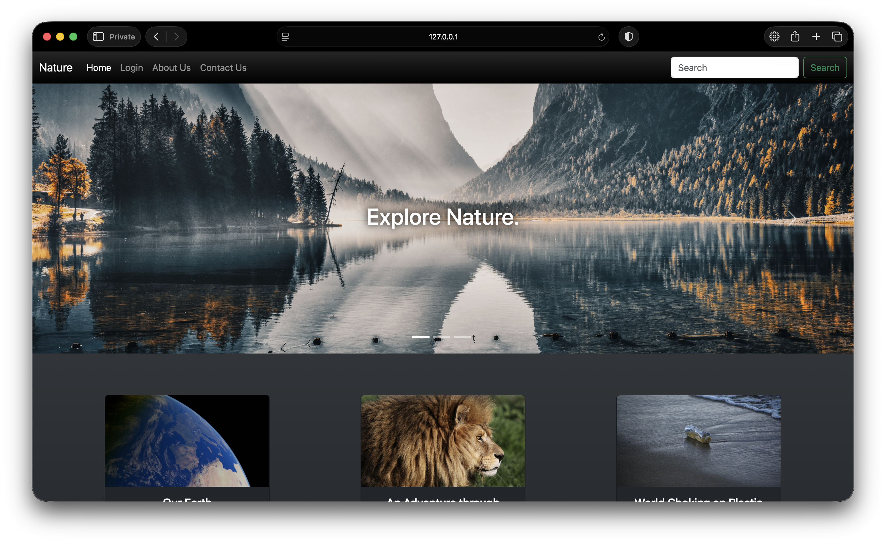
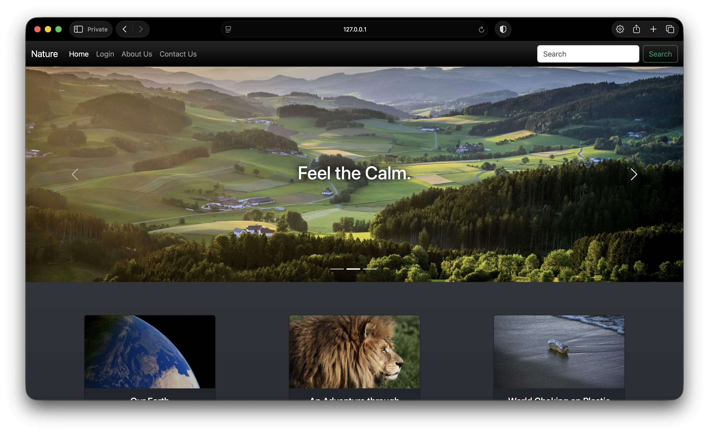
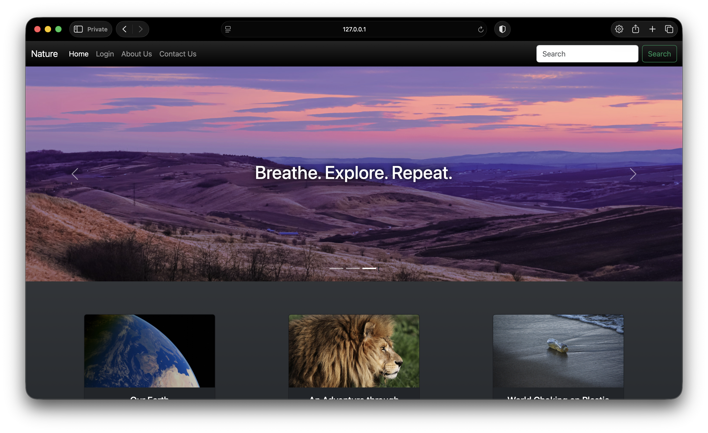
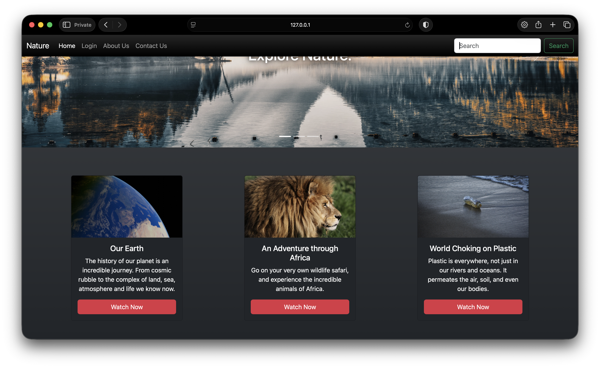
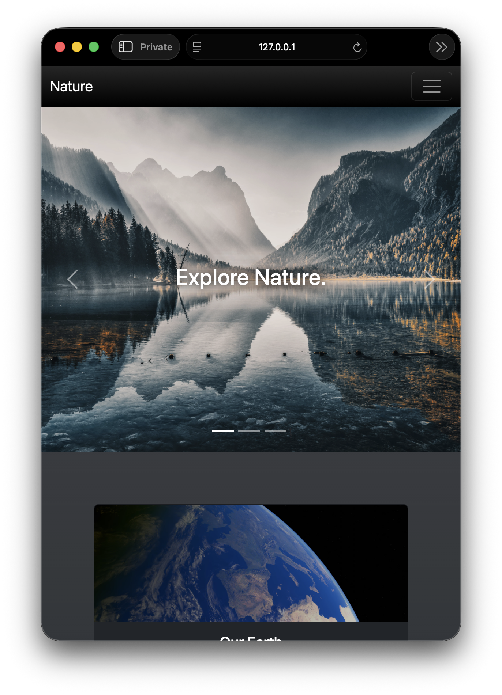
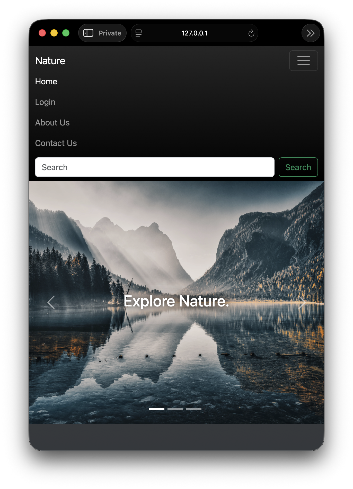
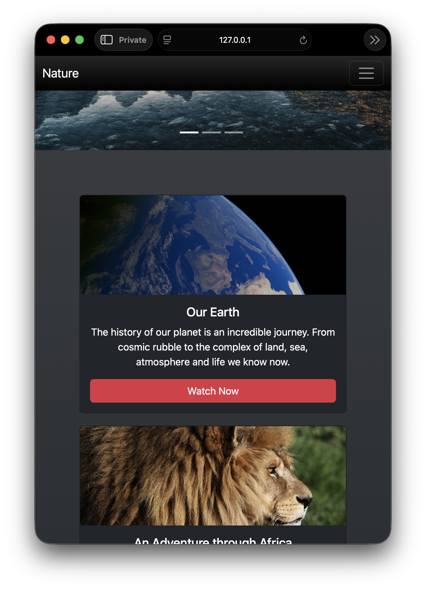
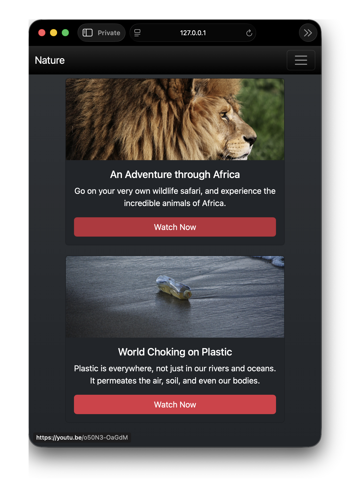

🌿 Nature Website

A small HTML & CSS practice project built using Bootstrap 5.
The project is a simple nature-themed webpage featuring a responsive navbar, image carousel, and content cards.

✨ Features

* Responsive Bootstrap navbar
* Nature image carousel
* Carousel captions and controls
* Responsive content cards
* Links to nature-related videos
* Mobile-friendly layout

🛠️ Built With

* HTML5
* CSS3
* Bootstrap 5

📁 Project Structure

├── index.html
├── style.css
└── README.md

🖥️ Screenshots

Desktop Layout

📱 Mobile Layout

🎯 Purpose

This project was created as a small side practice project to improve my understanding of HTML, CSS, responsive design, and Bootstrap components.

🚀 How to Run

Clone the repository and open index.html in any modern web browser.

⸻

Made as a small practice project while learning web development.